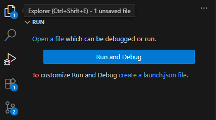

# Python 설치

## 설치 가이드

접기/펼치기

 

- Python 공식 웹사이트 downloads 링크 접속  
  https://www.python.org/downloads/
- Download Python {버전} 노란색 버튼 클릭  
  amd64는 window x86의 64비트 확장 아키텍처
- 설치된 installer 실행
- 디렉토리 생성 및 vscode에서 open
- vocode python extension 추가 (MicroSoft)
- deugging 설정  
    
  `create launch.json file` 링크 클릭 및 launch.json 파일 저장

## 템플릿

접기/펼치기

 

